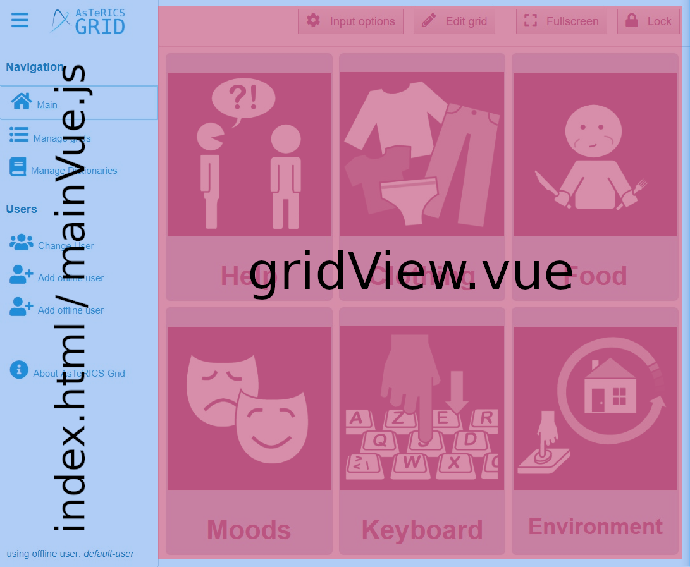

# Vue.js
This chapter is about [Vue.js](https://vuejs.org/), the single-page application framework used for AsTeRICS Grid.

1. [General](04_vuejs.md#general)
1. [Component structure](04_vuejs.md#component-structure)
1. [Used components](04_vuejs.md#used-components)

[Back to Overview](00_index.md)

## General
In AsTeRICS Grid [Vue.js](https://vuejs.org/) is used in order to manage views and it's elements in components and to create all kinds of interactivity in the UI. In Vue.js components can be organized in single `.vue` files, containing the HTML, Javascript and CSS needed for this component. These are the files and folders that are important regarding the usage of Vue.js:

* **[src/vue-components](https://github.com/asterics/AsTeRICS-Grid/tree/master/src/vue-components)**: contains all Vue.js single-file components (`.vue` files)
* **[index.html](https://github.com/asterics/AsTeRICS-Grid/blob/master/index.html)**: contains the HTML for the main Vue wrapper component consisting of the navigation sidebar and a placeholder for the currently show view
* **[src/js/vue/mainVue.js](https://github.com/asterics/AsTeRICS-Grid/blob/master/src/js/vue/mainVue.js)**: Javascript part for the main Vue component in `index.html`
* **[src/js/vue/vuePluginManager.js](https://github.com/asterics/AsTeRICS-Grid/blob/master/src/js/vue/vuePluginManager.js)**: defines custom Vue directives and filters that can be used globally, e.g. a [translate filter](07_i18n.md#vuejs-filter).

## Component structure
The main Vue wrapper component is defined in [index.html](https://github.com/asterics/AsTeRICS-Grid/blob/master/index.html) and [mainVue.js](https://github.com/asterics/AsTeRICS-Grid/blob/master/src/js/vue/mainVue.js). This line in `index.html` is a placeholder for the currently shown view of the application:
```
<component v-if="component" v-bind:is="component" v-bind="properties" :key="componentKey"></component>
```

The method [`MainVue.setViewComponent()`](https://github.com/asterics/AsTeRICS-Grid/blob/master/src/js/vue/mainVue.js) is used in order to change the currently shown view. This method is primarily used by [router.js](https://github.com/asterics/AsTeRICS-Grid/blob/master/src/js/router.js) which chooses the correct view based on the current [URL hash](https://en.wikipedia.org/wiki/Fragment_identifier) in the address. For instance `https://grid.asterics.eu/#grids` has the hash `#grids` and therefore will render the [manage grids](../documentation_user/02_navigation.md#manage-grids-view) component which is defined in file [allGridsView.vue](https://github.com/asterics/AsTeRICS-Grid/blob/master/src/vue-components/views/allGridsView.vue).

Figure 1 highlights the Vue.js components that are used for the main view:


*Fig. 1: Vue component structure of the main view, red part is replaced depending on the current navigation*

## Used components
The used Vue components can be found in the folder [src/vue-components](https://github.com/asterics/AsTeRICS-Grid/tree/master/src/vue-components) which contains the following folders:
* **components**: generic components that can be used in various places across the application:
    * **comparisonComponent.vue**: accordion component showing a comparison between online and offline users (information only)
    * **headerIcon.vue**: component used in the header of different views which shows a hamburger menu and the AsTeRICS Grid logo
* **modals**: contains all kinds of modals (popup dialogs):
    * **addMultipleModal.vue**: modal for importing multiple new grid elements at once, used in [edit view](../documentation_user/02_navigation.md#edit-view)
    * **editActionsModal.vue**: action edit modal for a grid element, see chapter [Actions](../documentation_user/05_actions.md#edit-actions-modal) chapter in user documentation. The file [editAREAction.vue](https://github.com/asterics/AsTeRICS-Grid/blob/master/src/vue-components/modals/editActionsSub/editAREAction.vue) is a sub-component of this modal containing the configuration of an [AsTeRICS action](../documentation_user/05_actions.md#asterics-action).
    * **editGridModal.vue**: edit modal for a grid element (label and image), see chapter [Grid appearance and layout](../documentation_user/03_appearance_layout.md#edit-modal) in user documentation
    * **importDictionaryModal.vue**: modal for importing new words to a dictionary, see chapter [Dictionaries](../documentation_user/07_dictionaries.md#add-words) in user documentation
    * **inputOptionsModal.vue**: modal for setting input options like e.g. scanning, see chapter [Input Options](../documentation_user/04_input_options.md) in user documentation
* **views**: contains different views which are rendered into the component placeholder described in [component structure](04_vuejs.md#component-structure):
    * **aboutView.vue**: view containing general information about AsTeRICS Grid
    * **addOfflineView.vue**: see [Offline users](../documentation_user/06_users.md#offline-users)
    * **allGridsView.vue**: see [Manage grids view](../documentation_user/02_navigation.md#manage-grids-view)
    * **dictionariesView.vue**: see [Manage dictionaries view](../documentation_user/02_navigation.md#manage-dictionaries-view)
    * **gridEditView.vue**: see [Edit view](../documentation_user/02_navigation.md#edit-view)
    * **gridView.vue**: see [Main view](../documentation_user/02_navigation.md#main-view)
    * **loginView.vue**: see [Change user view](../documentation_user/02_navigation.md#change-user-view)
    * **registerView.vue**: see [Online users](../documentation_user/06_users.md#online-users)
    * **welcomeView.vue**: see [](../documentation_user/02_navigation.md#welcome-view)
    
For general information about the structure and usage of Vue.js components, see the official documentation, for instance [Component Basics](https://vuejs.org/v2/guide/components.html).

[&#x2190; Previous Chapter](03_grid.md) [Next Chapter &#x2192;](05_datamodel.md)

[Back to Overview](00_index.md)


