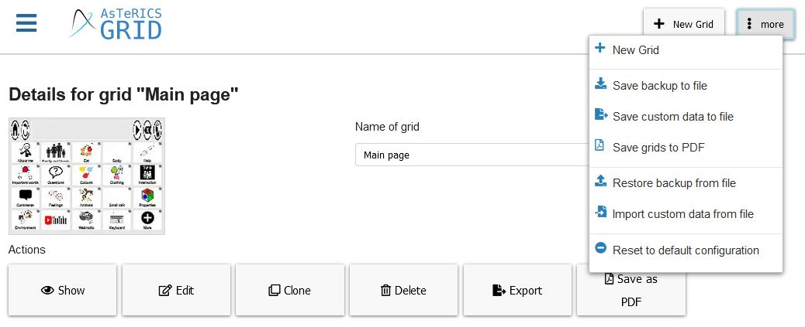

# Editing a Grid Set

This chapter explains how to change the appearance of a grid set and how to make backups.

- [Changing the Appearance](06_editing-grid.md#changing-the-appearance)
- [Changing the Global Grid](06_editing-grid.md#changing-the-global-grid)
- [Backup](06_editing-grid.md#backup)

[Back to Overview](README.md)

Options for editing a Grid are located under `Settings -> Appearance` and in the `Manage grids` menu. 

## Changing the Appearance

Go to `Settings -> Appearance` for the following options:
- **Changing the Text**: You can change the position, the font family, convert it to uppercase or lovercase and change the font size. With `Mode for handling too long texts` you can set up if the font should shrink to adapt to long labels or if the label should be truncated or there should be an elipsis. You can set the maximum number of lines of a label, the line height and the font color. `Auto-size keyboard letters` will make them big to fit the element. If you want smaller fonts you can deselect that option and have it have the same font size as other text-only elements.
- **Changing the Appearance of the Elements**: Decide on the colors of the grid and the elements, border width, the space between elements and the border radius.

To change the setup of the global grid and the collect element, check [chapter 06](06_editing-grid.md) respectively [chapter 07](07_editing-grid-element.md) 

## Changing the Global Grid

The global grid is usually shown on all the grids and usually has elements like a home button, a collect element to show the sentence and elements like a `back` and `delete` button.

The global grid can be activated/deactivated and edited in the "Manage Grids" view at the bottom or by `More -> Edit global grid` while editing any other grid: 

*Figure 1: "Manage grids" - view - Global Grid*

It can also be deactivated on specific grids. More information in [chapter 06](06_editing-grid.md)

## Backup

We **highly recommend to do backups** if you are using AsTeRICS Grid on a regular basis and have put some effort into customizing own grids for your use-case. This is why backups are important:

1. **Offline users**: since all data is only stored in an browser-internal storage, any browser crash or failure of your device could cause data loss.
2. **Online users**: Although online users are not susceptible to device or browser errors, data loss is still possible because of the encryption of the user data. If the user forgets his password or decryption fails because of any kind of programming error the data cannot be recovered. Backups are saved to an unencrypted file and therefore can recover the user data in such a case.

To create a backup you need to go to `Manage grids" -> "more" button`

*Figure 2: "Manage grids" - view - "more" button*

Under the `"more" button` you will find the following options related to backups:

1. **Save backup to file**: creates and downloads a `.grd` file containing a backup of all current grids, dictionaries and input configuration. In this case, a file called `asterics-grid-backup.grd` is downloaded that can be renamed to more easily identify the contents of the copy
2. **Save custom data to file**: creates and downloads a backup copy as well, but data can be customized with the following options: 
   1. Select grid: export a specific (group of) grid(s) or all available grids
   2. Export languages: select wheter to export all the languages in which the communicator is translated or only one of them (current content language)
   3. Export dictionaries: can be activated / deactivated
   4. Export user settings and input configuration: can be activated / deactivated (preserves specific adjustments like color settings, content language or input settings (scanning or direct selection))
   5. Export global grid: can be activated / deactivated 
3. **Restore backup from file**: deletes the existing configuration and replaces it with data from a `.grd` file
4. **Import custom data from file**:  imports data from a `.grd` file as well, but data can be customized. You can choose if you want to import dictionaries, of you want to import user settings and input configuration and if oyu want to delet existing data before importing.
5. **Reset to default configuration**: deletes all current grids and replaces them with the default demo configuration

[Back to Overview](README.md)