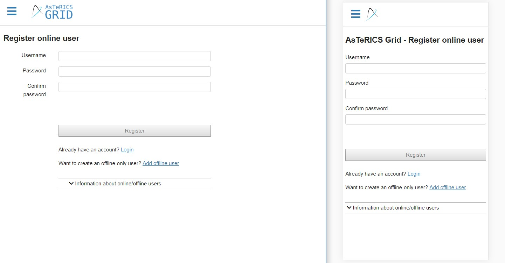
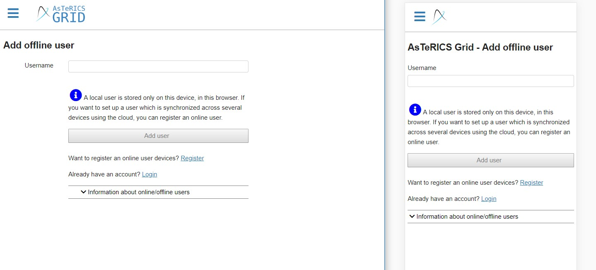

# Users

**Video on YouTube:** [Offline and online users](https://www.youtube.com/watch?v=CoRUQJJnYaY&list=PL0UXHkT03dGrIHldlEKR0ZWfNMkShuTNz&index=16&t=0s) (German, but auto-translated subtitles available)

This chapter is about offline and online users, their differences and how to add or register them.

[Back to Overview](README.md)

In AsTeRICS Grid a user in general holds a set of grids which realize a specific solution for this user. A user doesn't necessarily have to be a real person, it's also possible to create a "user" for a specific usecase, for instance a specific smart home control interface.

### Internet connection requirements

Despite being a web-application that runs in an internet browser, AsTeRICS Grid is designed to be usable also without internet connection.

**Internet connection is required for:**

1. First usage of AsTeRICS Grid. Initially opening <a href="https://grid.asterics.eu/" target="_blank">https://grid.asterics.eu/</a> automatically downloads the whole application to browser cache and therefore AsTeRICS Grid is usable offline afterwards.
2. Synchronizing configuration of online users

**Without internet access it is possible to:**

1. Use AsTeRICS Grid by just re-opening <a href="https://grid.asterics.eu/" target="_blank">https://grid.asterics.eu/</a> in the browser (only initial access needs internet access).
2. switch between all saved users, which can be both offline and online users

## Online users

Online users are users whose configuration is automatically synchronized with a cloud storage. Therefore it's possible to this user to log in on different devices while the configuration is always up-to-date on each device.

In view "add online user" it's possible to register a new online user, Figure 6:

*Fig. 6: Add online user view - register*

The following information is important for registering an online user:

* The only data that is needed are a **username** and a **password**. The username is needed for uniquely identifying a user and the password for securing his account and encrypting the data.
* If you want to **use AsTeRICS Grid completely anonymously** just use a username without any relation to your person.
* Since all data is **end-to-end encrypted** only the user itself can ever see his data and configuration, no server admin or anyone else.
* End-to-end encryption is great for privacy, however it has the drawback that the **data is lost**, if you logout your online account on all devices and forget your password. In this case there is **no possibility of password recovery**, so **remember your password carefully**. It's also recommended to **do backups** of your grids (see [Manage grids view](02_navigation.md#additional-options)).
* Usernames must start lowercase, valid characters are [a-z], [0-9] and ["-", "_"], valid length is 3-50 characters.

### Synchronization states

Online users can have the following synchronization states which are shown at the bottom of the navigation bar:

 **Synchronizing**: configuration is currently synchronizing with the cloud

 **Synchronized**: configuration is up-to-date with the cloud storage

 **Synchronization failed**: synchronization not possible, no internet connection

 **Synchronization paused**: synchronization paused for a short time and will be resumed shortly

 **Online only**: user is logged in online-only, meaning that configuration is not saved on the current device. Changes still will be saved in the cloud and therefore also be synchronized to other devices where this user is logged in. Users will be logged in online-only if the "remember checkbox" is unchecked when logging in (see [change user view](02_navigation.md#change-user-view)).

## Offline users

Offline users are users whose configuration is only saved offline in the storage of the currently used browser. This type of users are perfectly suited for use cases where AsTeRICS Grid is only used on a single device.

In view "add offline user" it's possible to add a new offline user (see [Terms](01_terms.md#user)), Figure 7:

*Fig. 7: Add offline user view*

The following information is important regarding offline users:

* All **data of an offline user never leaves the device**, it's stored in a browser-internal database.
* Usernames must start lowercase, valid characters are [a-z], [0-9] and ["-", "_"], valid length is 3-50 characters.

## Backup

Regardless which type of users are used, we **highly recommend to do backups** if you are using AsTeRICS Grid on a regular basis and have put some effort into customizing own grids for your use-case. See [manage grids view](02_navigation.md#additional-options) for instructions how to create and restore backups.

This is why backups are important:

1. **Offline users**: since all data is only stored in an browser-internal storage, any browser crash or failure of your device could cause data loss.
2. **Online users**: Although online users are not susceptible to device or browser errors, data loss is still possible because of the encryption of the user data. If the user forgets his password or decryption fails because of any kind of programming error the data cannot be recovered. Backups as described in [manage grids view](02_navigation.md#additional-options) are saved to an unencrypted file and therefore can recover the user data in such a case.

[&#x2190; Previous Chapter](05_actions.md) [Next Chapter &#x2192;](07_dictionaries.md)

[Back to Overview](README.md)
