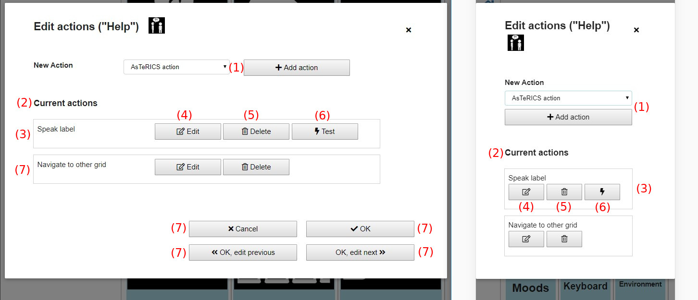

# Grid element actions
This chapter is about actions that can be performed if a grid element is selected and how to configure them:

1. [Edit actions modal](05_actions.md#edit-actions-modal)
1. [Action Types](05_actions.md#speak-label)
    * [Speak label](05_actions.md#speak-label)
    * [Navigate to other grid](05_actions.md#navigate-to-other-grid)
    * [Speak custom text](05_actions.md#speak-custom-text)
    * [Fill prediction elements](05_actions.md#fill-prediction-elements)
    * [Collect element action](05_actions.md#collect-element-action)
    * [AsTeRICS Action](05_actions.md#asterics-action)

[Back to Overview](00_index.md)

## Edit actions modal

Choosing "Actions" in the [Edit grid element menu](03_appearance_layout.md#editing-grid-elements) opens a configuration modal (Fig. 1):

*Fig. 1: Edit actions modal*

This modal configures the actions that will be performed if the grid element is selected. These are the elements in the action modal:

1. **New action**: adds a new action to the grid, in the combobox the action type has to be selected
1. **Current actions**: list of currently configured actions that will be performed if the grid element is selected
1. **Speak label**: first configured action of this element - speak the label of the element
1. **Edit**: edit and configure the particular action
1. **Delete**: delete the action from this grid element
1. **Test**: tests the action, e.g. speaks the label. This button is not available for all types of actions.
1. **Cancel**: discard any changes and close the modal
1. **OK**: save all changes and close the modal
1. **OK, edit previous**: save all changes and edit the actions of the previous element
1. **OK, edit next**: save all changes and edit the actions of the next element

## Action types

These are the types of actions that are selectable (Fig. 1, number 1):

1. **Speak label**: speaks the label of the element using a computer voice (text-to-speech)
1. **Navigate to other grid**: navigates to another grid
1. **Speak custom text**: speaks a customizeable text using a computer voice (text-to-speech)
1. **Fill prediction elements**: fills all [prediction elements](01_terms.md#grid-element) in the current grid with word suggestions
1. **Collect element action**: performs actions on [collect elements](01_terms.md#grid-element) in the current grid, e.g. clearing it or copying it's text to clipboard
1. **AsTeRICS Action**: do an action in a running [model](01_terms.md#asterics-model) in the [AsTeRICS Framework](01_terms.md#asterics-framework)

### Speak label
Clicking on "Edit" on a "speak label" action (or creating a new one) shows the following configuration possibilities:

By default the language of the browser/system is selected. Available languages can differ depending on the browser, from experience [Google Chrome](https://www.google.com/chrome/) offers most languages. Clicking on the "Test" button speaks the label in the selected language.

*Note: some browsers like Internet Explorer do not support text-to-speech. In these browsers speak actions will do nothing.*

### Navigate to other grid
Clicking on "Edit" on a "navigate to other grid" action (or creating a new one) shows the following configuration possibilities:

"Grid to navigate" selects the grid to switch to if this action is performed. The combobox contains a list of the names of all available grids of the current user.

### Speak custom text
Clicking on "Edit" on a "speak custom text" action (or creating a new one) shows the following configuration possibilities:

For language selection the same conditions as for [speak label](05_actions.md#speak-label) actions apply. "Text to speak" is the custom text that should be spoken. The button "Test" tests the configuration and speaks the current text.

### Fill prediction elements
The action "fill prediction elements" fills all [prediction elements](01_terms.md#grid-element) in the grid with word suggestions. Suggestions are calculated on the basis of the label of the current element, so an "fill prediction elements" action of an element with label "A" will fill the prediction elements with the most common words starting with character "A":

Clicking on "Edit" on a "fill prediction elements" action (or creating a new one) shows the following configuration possibilities:

The meaning of the elements is:
1. **Refresh suggestions on change** (only available on [collect elements](01_terms.md#grid-element)): if checked prediction elements are recalculated and refilled on every change of the collection element on base of the current value of the collection element: 

1. **Dictionary to use**: select the dictionary you want to use (see [manage grids](02_navigation.md#manage-grids-view)). If nothing selected words from all available dictionaries will be suggested.

### Collect element action
### AsTeRICS Action

  
[&#x2190; Previous Chapter](03_appearance_layout.md) [Next Chapter &#x2192;](04_input_options.md)

[Back to Overview](00_index.md)